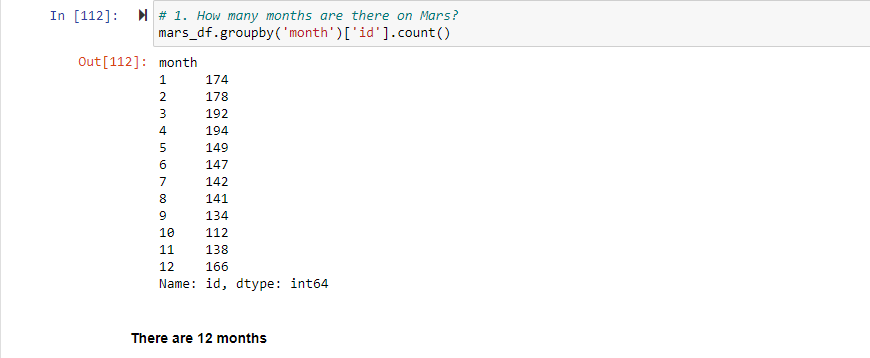

# Mission-to-Mars
Webscraping

## Overview 
SpaceForward is an ambitious company that is doing research about resource extraction from nearby planets. As a young analyst working for this comapny, Robin has been tasked to gather information about the climate of Mars. She has also been asked to collect news items about the Mars mission.

### Purpose
The information about the climate of Mars or the news articles about the Mars mission are not readily available in either CSV, JSON files or through API's. This information is available on public websites. Hence the need to retireve the information using webscrapping.

## Results

- The [Mars NASA news site](https://redplanetscience.com) is inspected and the tiltes and preview text are extracted and formatted using BeautifulSoup. The list is then saved as a JSON file and as documents in a Mongo Database.

- From the [Mars Temperature Data Site](https://data-class-mars-challenge.s3.amazonaws.com/Mars/index.html) the weather data is extracted using BeautifulSoup and stored in Pandas DataFrame.

- Further analysis is performed to answer the following questions :-

    1. How many months exist on Mars?

        There are 12 months in Mars.
        
        

    2. How many Martian (and not Earth) days worth of data exist in the scraped dataset?

        There are 1867 Martian days worth of data.

    3. What are the coldest and the warmest months on Mars (at the location of Curiosity)? 

        The coldest month is the third month and the warmest month is the eighth month.

    4. Which months have the lowest and the highest atmospheric pressure on Mars?

        The lowest atmospheric pressure on Mars is in the sixth month and the highest pressure is in the ninth month.

    5. About how many terrestrial (Earth) days exist in a Martian year? 

        The distance from peak to peak is roughly (1425-750), or 675 days. A year on Mars appears to be about 675 days from the plot.
        
- The weather data is exported to a CSV file.

